## Malware repositories and Virus total 

### 1st thing is to get the malware hashes that is md5 and sha256

```bash
C:\Users\sire\Desktop
λ sha256sum.exe Malware.Unknown.exe.malz
92730427321a1c4ccfc0d0580834daef98121efa9bb8963da332bfd6cf1fda8a *Malware.Unknown.exe.malz

C:\Users\sire\Desktop
λ md5sum.exe Malware.Unknown.exe.malz
1d8562c0adcaee734d63f7baaca02f7c *Malware.Unknown.exe.malz

C:\Users\sire\Desktop
λ
```

Checking the file hashes in Virustotal we can see alot of vendors flagged the has as malicous 

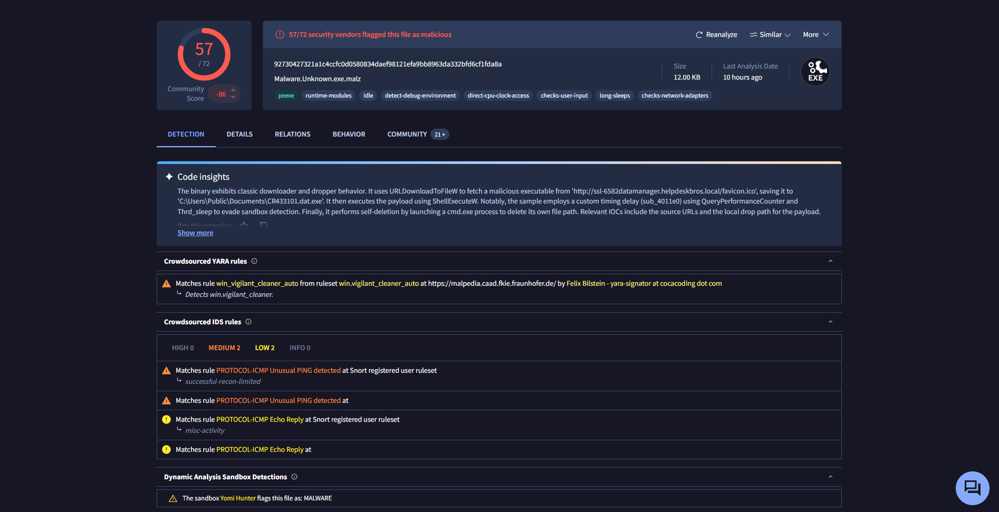

57/72 security vendors flagged this file as malicious glagged this file as malicous and we also have other file signatures associated with the file as well as other names 

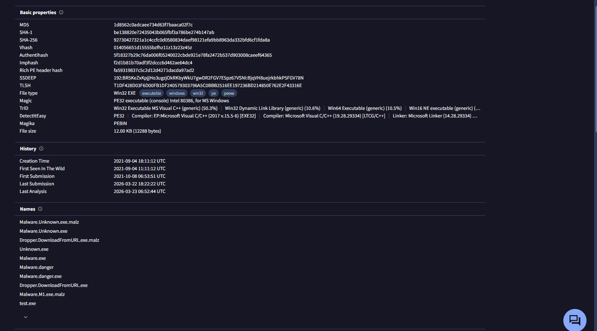

Its also shows the mitre attack framework in relaiton to this malware  where by you can see in the indicators of removal , Drops batch files with force delete cmd 
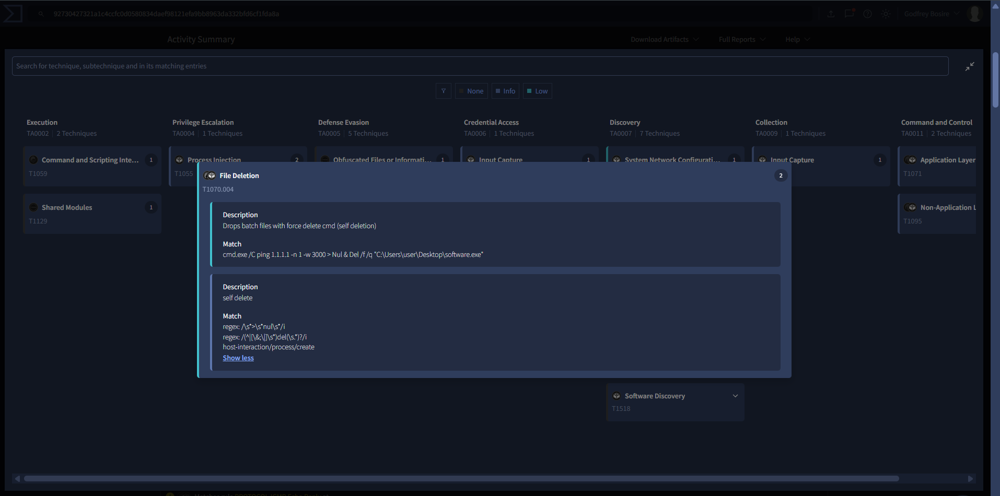

## String and floss

Definations 

`string` => is an array of characters such as 'hello world" but computers will treat this string as an array of characters with an null byte at the end of the string 
but in malware analysis 

Using the command floss , we can see important strings in relaiton to malware or somecommand or ddl file called so we take them down to build a triage just from the inital stage and we can't make any concusin because we need to dig in deeper to uderstand what the maleare really does 

```text

FLARE FLOSS RESULTS (version v3.1.1-0-g3cd3ee6)

+------------------------+-------------------------------------------------------------------------------+
| file path              | Malware.Unknown.exe.malz                                                      |
| identified language    | unknown                                                                       |
| extracted strings      |                                                                               |
|  static strings        | 177 (2521 characters)                                                         |
|   language strings     |   0 (   0 characters)                                                         |
|  stack strings         | 1                                                                             |
|  tight strings         | 0                                                                             |
|  decoded strings       | 0                                                                             |
+------------------------+-------------------------------------------------------------------------------+


 ──────────────────────────── 
  FLOSS STATIC STRINGS (177)  
 ──────────────────────────── 

+-----------------------------------+
| FLOSS STATIC STRINGS: ASCII (169) |
+-----------------------------------+

!This program cannot be run in DOS mode.

C:\Users\Matt\source\repos\HuskyHacks\PMAT-maldev\src\DownloadFromURL\Release\DownloadFromURL.pdb

.rsrc$01
.rsrc$02
GetModuleFileNameW
CloseHandle
CreateProcessW
KERNEL32.dll
ShellExecuteW
SHELL32.dll
MSVCP140.dll
URLDownloadToFileW
urlmon.dll
InternetOpenUrlW
InternetOpenW
WININET.dll
.......

SetUnhandledExceptionFilter
GetCurrentProcess
TerminateProcess
IsProcessorFeaturePresent
QueryPerformanceCounter
GetCurrentProcessId
GetCurrentThreadId
GetSystemTimeAsFileTime
InitializeSListHead
IsDebuggerPresent
GetModuleHandleW
.......

<?xml version='1.0' encoding='UTF-8' standalone='yes'?>
<assembly xmlns='urn:schemas-microsoft-com:asm.v1' manifestVersion='1.0'>
  <trustInfo xmlns="urn:schemas-microsoft-com:asm.v3">
    <security>
      <requestedPrivileges>
        <requestedExecutionLevel level='asInvoker' uiAccess='false' />
      </requestedPrivileges>
    </security>
  </trustInfo>
</assembly>


.........

+------------------------------------+
| FLOSS STATIC STRINGS: UTF-16LE (8) |
+------------------------------------+

jjjj
cmd.exe /C ping 1.1.1.1 -n 1 -w 3000 > Nul & Del /f /q "%s"
http://ssl-6582datamanager.helpdeskbros.local/favicon.ico
C:\Users\Public\Documents\CR433101.dat.exe
Mozilla/5.0
http://huskyhacks.dev
ping 1.1.1.1 -n 1 -w 3000 > Nul & C:\Users\Public\Documents\CR433101.dat.exe
open

........
```


## Analyzing the Import Address Table

Viewing this Malware using the file PEview we can see alot that is going on,the left side we can see Import address tables as well in the middle we can see like a portable executable with giantic array of bites in hexadecimal wiith the fist column having the ofset if the program where in relation to the beginning of the program did these bytes exists 
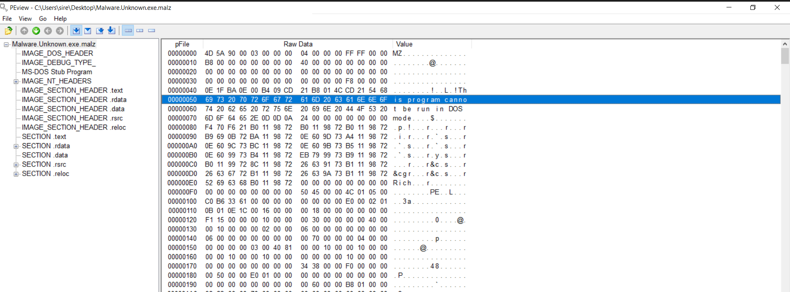

Every portable executable kinda follows the same format with the starting byte MZ which is a signature meaning a portable executable 


In the IMAGE_NT_HEADERTS,IMAGE FILE HEADER ,we can see the date stamp of the malware when it was complied or build
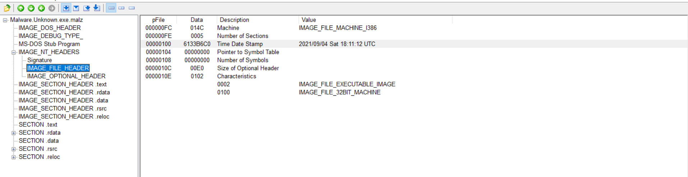

The date sometime may say 1992, like compiled then it may not neccessary means it was compiled then but is a Balkan delfi compiler written in delfi and it will always have a timestamp of 1992


### IMAGE_SECTION_HEADER.text
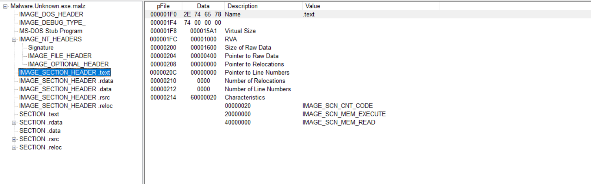

One thing to take into considertation is the Vitual size and the Size of Raw Data and compare the value written in hexadecimals 

- Virtual size = 15A1 (5537 in decimal) | amount of data on the disk then the vinary is run 
- Size of the Raw data = 1600 (5632 in decimal)


If these two values are similar we can ascertain that the size of raw data of the binary is roughly the same as the virtual size 

If then size of the raw data is much lower than the  virtual siz when it's is run, we can say there is more to this binary than is initially avaiblae to us and we can thing of a packed binary 

### SECTION. rdata/IMPORT Address Table 

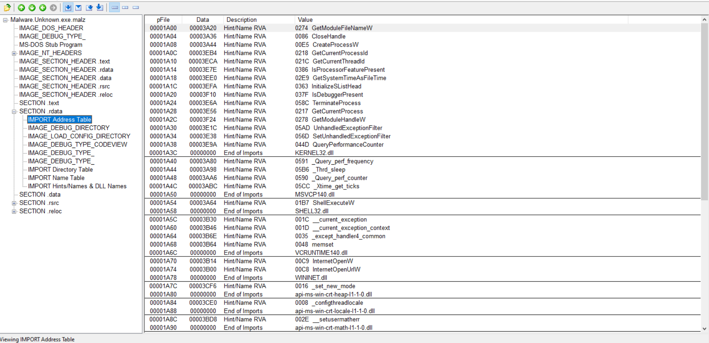

The windows API 

## Introduction to the Windows API

API => Application programing interface 

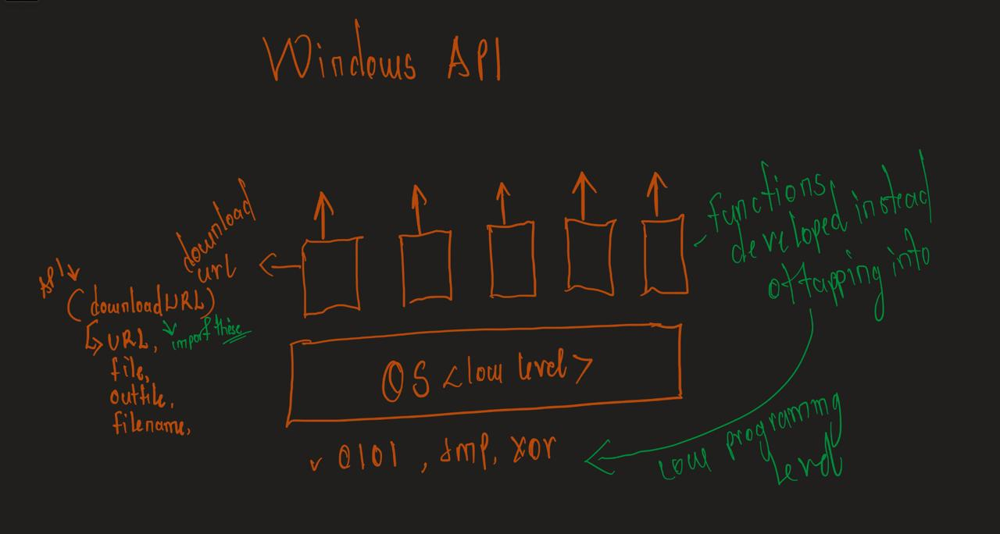

How the Windows API works 


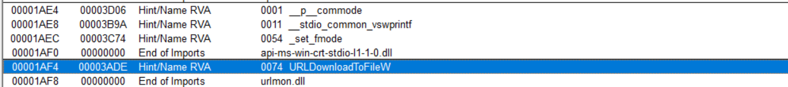

Checking the URLDownloadtoFile API 


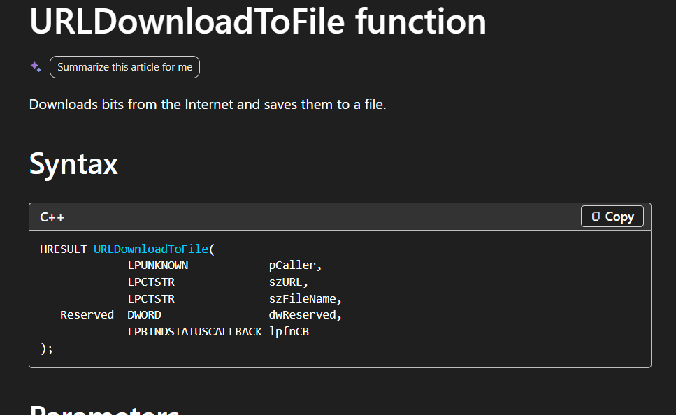


We can see its that this file as malicous fucitons such as downloading files to the machine like second stage executable 


## MalAPI.io

[malapi.io](https://malapi.io/)
<iframe src="https://malapi.io/" width="100%" height="600"></iframe>

This is like putting together gtfobins and motre atack together for specific cataloging malicous windows API that can be used to identifiying samples of malware that those API are used maliciously in

In the documentation of the API, you will also get a malware sample in relaiton to those API that you can experiment with 


## To Pack Or Not To Pack: Packed Malware Analysis

Packing is a compresion or encryption mechanism to make a piece of malware look different than it;s original source. Basically a compression of an existing malware

When you open a packed malware out the bat we can see UPX, basically which is a program used to pack malware 
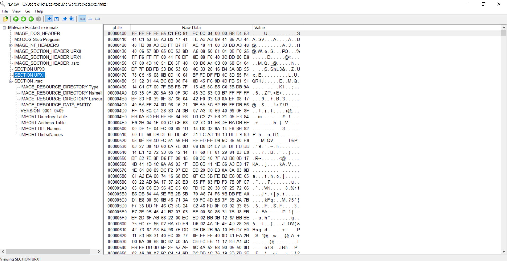

We still have a import address table which is quit small compared to the unpacked malware on the right hand size 
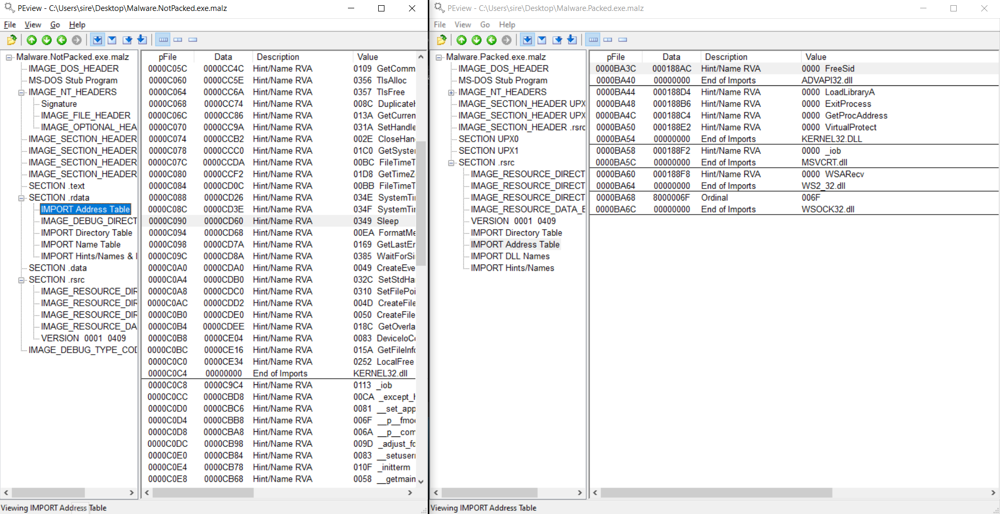

This means when the malware inflates back to it;s original program some API calls such as GetProcAddress and LoadLibratA are invoked to find other API calls 

Checking the size of the raw data compare to the virtual size is quite so large 
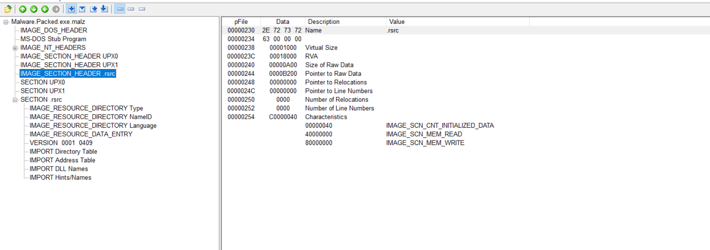

Like here the size of Raw data is 0, meaning we are dealing with a packed malware

## Combining Analysis Methods: PEStudio

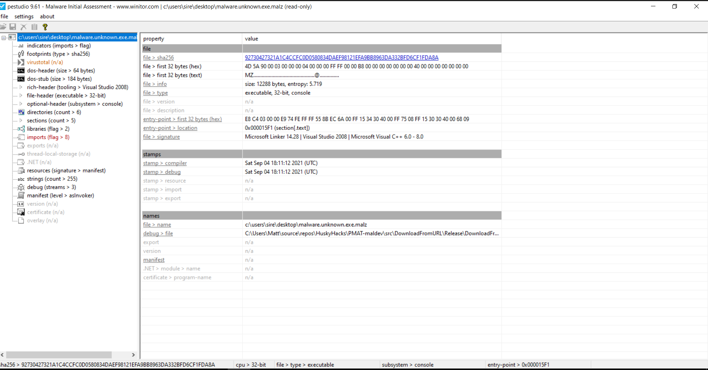
When you load the malware in PEStudio we see the hashes of the file 

we also see the MZ, like the fisrt-byte-text meaning is portable excecutable and it even has the CPU architecture which is a 32bit artchitectre 

Malicous libralies or dlls 
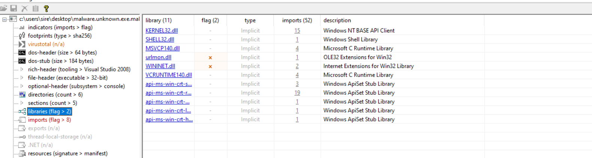

We can also the string that we already say from the floss command with even malicous API calls or command made out 

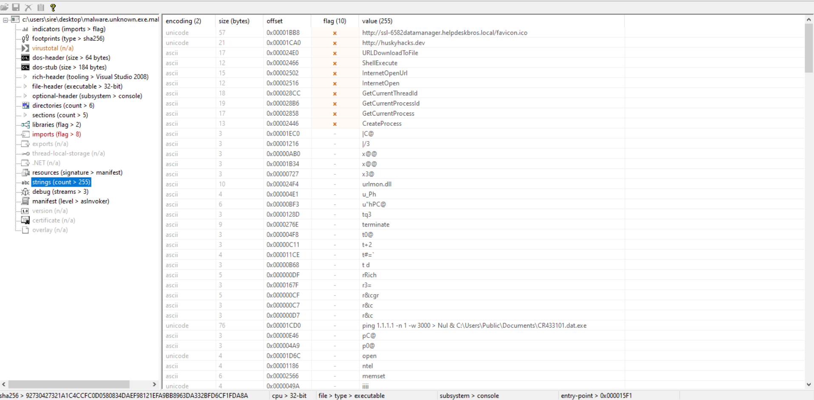


## CAPA

CAPA  is a program that detects malicious capabilities in suspicious programs by using a set of rules. These rules are meant to be as high-level and human readable as possible. For example, Capa will examine a binary, identify an API call or string of interest, and match this piece of information against a rule that is called "receive data" or "connect to a URL". It translates the technical information in a binary into a simple, human-readable piece of information.

Running CAPA : 

```bash
λ capa Malware.Unknown.exe.malz                                                                           
┌─────────────┬────────────────────────────────────────────────────────────────────────────────────┐      
│ md5         │ 1d8562c0adcaee734d63f7baaca02f7c                                                   │      
│ sha1        │ be138820e72435043b065fbf3a786be274b147ab                                           │      
│ sha256      │ 92730427321a1c4ccfc0d0580834daef98121efa9bb8963da332bfd6cf1fda8a                   │      
│ analysis    │ static                                                                             │      
│ os          │ windows                                                                            │      
│ format      │ pe                                                                                 │      
│ arch        │ i386                                                                               │      
│ path        │ C:/Users/sire/Desktop/Malware.Unknown.exe.malz                                     │      
└─────────────┴────────────────────────────────────────────────────────────────────────────────────┘      
┌────────────────────────────────┬─────────────────────────────────────────────────────────────────┐      
│ ATT&CK Tactic                  │ ATT&CK Technique                                                │      
├────────────────────────────────┼─────────────────────────────────────────────────────────────────┤      
│ DEFENSE EVASION                │ Indicator Removal::File Deletion [T1070.004]                    │      
└────────────────────────────────┴─────────────────────────────────────────────────────────────────┘      
┌────────────────────────────┬─────────────────────────────────────────────────────────────────────┐      
│ MBC Objective              │ MBC Behavior                                                        │      
├────────────────────────────┼─────────────────────────────────────────────────────────────────────┤      
│ COMMAND AND CONTROL        │ C2 Communication::Receive Data [B0030.002]                          │      
│ COMMUNICATION              │ HTTP Communication [C0002]                                          │      
│                            │ HTTP Communication::Create Request [C0002.012]                      │      
│                            │ HTTP Communication::Download URL [C0002.006]                        │      
│                            │ HTTP Communication::Open URL [C0002.004]                            │      
│ DEFENSE EVASION            │ Self Deletion::COMSPEC Environment Variable [F0007.001]             │      
│ PROCESS                    │ Create Process [C0017]                                              │      
└────────────────────────────┴─────────────────────────────────────────────────────────────────────┘      
┌───────────────────────────────────────────────┬──────────────────────────────────────────────────┐      
│ Capability                                    │ Namespace                                        │      
├───────────────────────────────────────────────┼──────────────────────────────────────────────────┤      
│ self delete                                   │ anti-analysis/anti-forensic/self-deletion        │      
│ receive data                                  │ communication                                    │      
│ reference HTTP User-Agent string              │ communication/http                               │      
│ connect to URL                                │ communication/http/client                        │      
│ create HTTP request                           │ communication/http/client                        │      
│ contains PDB path                             │ executable/pe/pdb                                │      
│ create process on Windows (2 matches)         │ host-interaction/process/create                  │      
└───────────────────────────────────────────────┴──────────────────────────────────────────────────┘      
                                                                                                          
                                                                                                          
C:\Users\sire\Desktop                                                                                     
λ                                                                                                         
```
 Immediately, we see some boiler-plate information about the binary, like its hashes. But then, we get some interesting high-level information about the program.

 The first block in the output labeled "ATT&CK Tactic - ATT&CK Technique" is worth examining in depth.

```bash
┌────────────────────────────────┬─────────────────────────────────────────────────────────────────┐      
│ ATT&CK Tactic                  │ ATT&CK Technique                                                │      
├────────────────────────────────┼─────────────────────────────────────────────────────────────────┤      
│ DEFENSE EVASION                │ Indicator Removal::File Deletion [T1070.004]                    │      
└────────────────────────────────┴─────────────────────────────────────────────────────────────────┘    
```
[So `T1070` means Adversaries may delete or modify artifacts generated within systems to remove evidence of their presence or hinder defenses. Various artifacts may be created by an adversary or something that can be attributed to an adversary’s actions](https://attack.mitre.org/techniques/T1070/)

### Malware Behavioral Catalog (MBC)
The next output is the Malware Behavioral Catalog (MBC) Objectives and Behaviors. This is a similar classification system to MITRE ATT&CK but focuses on malware specifically.

[The full MBC Matrix can be found here]( https://github.com/MBCProject/mbc-markdown#malware-objective-descriptions)

MBC translates MITRE ATT&CK items into terms that focus on the malware analysis use case. So understandably, we do get some useful output from this section:

```bash
┌────────────────────────────┬─────────────────────────────────────────────────────────────────────┐      
│ MBC Objective              │ MBC Behavior                                                        │      
├────────────────────────────┼─────────────────────────────────────────────────────────────────────┤      
│ COMMAND AND CONTROL        │ C2 Communication::Receive Data [B0030.002]                          │      
│ COMMUNICATION              │ HTTP Communication [C0002]                                          │      
│                            │ HTTP Communication::Create Request [C0002.012]                      │      
│                            │ HTTP Communication::Download URL [C0002.006]                        │      
│                            │ HTTP Communication::Open URL [C0002.004]                            │      
│ DEFENSE EVASION            │ Self Deletion::COMSPEC Environment Variable [F0007.001]             │      
│ PROCESS                    │ Create Process [C0017]                                              │      
└────────────────────────────┴─────────────────────────────────────────────────────────────────────┘ 
```

Here, Capa has identified items of interest in the binary, matched them to rules based on MBC items, and returned the results. We've accurately identified that the Malware.Unknown.exe.malz sample has the capability to

- Send and receive data
- Do so over HTTP
- Create and terminate processes


Let's rerun Capa with the verbose flag. 

```bash
C:\Users\sire\Desktop
λ capa Malware.Unknown.exe.malz -v
md5                     1d8562c0adcaee734d63f7baaca02f7c
sha1                    be138820e72435043b065fbf3a786be274b147ab
sha256                  92730427321a1c4ccfc0d0580834daef98121efa9bb8963da332bfd6cf1fda8a
path                    C:/Users/sire/Desktop/Malware.Unknown.exe.malz
timestamp               2026-03-23 12:37:08.872591
capa version            9.3.1
os                      windows
format                  pe
arch                    i386
analysis                static
extractor               VivisectFeatureExtractor
base address            0x400000
rules                   C:/Users/sire/AppData/Local/Temp/_MEI36682/rules
function count          43
library function count  26
total feature count     1087

self delete
namespace  anti-analysis/anti-forensic/self-deletion
scope      function
matches    0x401080

receive data
namespace    communication
description  all known techniques for receiving data from a potential C2 server
scope        function
matches      0x401080

reference HTTP User-Agent string
namespace  communication/http
scope      function
matches    0x401080

connect to URL
namespace  communication/http/client
scope      instruction
matches    0x4010F6

create HTTP request
namespace  communication/http/client
scope      function
matches    0x401080

download URL
namespace  communication/http/client
scope      function
matches    0x401080

contains PDB path
namespace  executable/pe/pdb
scope      file

create process on Windows (2 matches)
namespace  host-interaction/process/create
scope      basic block
matches    0x4010E3
           0x401142


```

There's a lot more output here! Capa identifies the rule that is triggered for the binary, the type of rule, and even the location in the binary where the rule is triggered in hex form! We can start to see the mechanism here for how Capa identifies things that trigger the rules - it uses the Vivisect parser to examine interesting strings and byte patterns and matches them against the rules.

 run Capa one more time with a double verbose output

 ```bash
 C:\Users\sire\Desktop
λ capa Malware.Unknown.exe.malz -vv
md5                     1d8562c0adcaee734d63f7baaca02f7c
sha1                    be138820e72435043b065fbf3a786be274b147ab
sha256                  92730427321a1c4ccfc0d0580834daef98121efa9bb8963da332bfd6cf1fda8a
path                    C:/Users/sire/Desktop/Malware.Unknown.exe.malz
timestamp               2026-03-23 12:37:34.543600
capa version            9.3.1
os                      windows
format                  pe
arch                    i386
analysis                static
extractor               VivisectFeatureExtractor
base address            0x400000
rules                   C:/Users/sire/AppData/Local/Temp/_MEI16002/rules
function count          43
library function count  26
total feature count     1087

contain loop (2 matches, only showing first match of library rule)
author  moritz.raabe@mandiant.com
scope   function
function @ 0x4011E0
  or:
    characteristic: loop @ 0x4011E0

self delete
namespace  anti-analysis/anti-forensic/self-deletion
author     michael.hunhoff@mandiant.com, @mr-tz
scope      function
att&ck     Defense Evasion::Indicator Removal::File Deletion [T1070.004]
mbc        Defense Evasion::Self Deletion::COMSPEC Environment Variable [F0007.001]
function @ 0x401080
  and:
    optional:
      regex: /\s*>\s*nul\s*/i
        - "cmd.exe /C ping 1.1.1.1 -n 1 -w 3000 > Nul & Del /f /q \"%s\"" @ 0x401171
        - "ping 1.1.1.1 -n 1 -w 3000 > Nul & C:\\Users\\Public\\Documents\\CR433101.dat.exe" @ 0x40111C
    or:
      match: host-interaction/process/create @ 0x4010E3, 0x401142
        or:
          api: CreateProcess @ 0x4011AD
        or:
          api: ShellExecute @ 0x401128
    or:
      regex: /(^|[\&;\|]\s*)del(\s.*)?/i
        - "cmd.exe /C ping 1.1.1.1 -n 1 -w 3000 > Nul & Del /f /q \"%s\"" @ 0x401171

receive data
namespace    communication
author       william.ballenthin@mandiant.com
scope        function
mbc          Command and Control::C2 Communication::Receive Data [B0030.002]
description  all known techniques for receiving data from a potential C2 server
function @ 0x401080
  or:
    match: download URL @ 0x401080
      or:
        api: URLDownloadToFile @ 0x4010D9

reference HTTP User-Agent string
namespace   communication/http
author      @mr-tz, mehunhoff@google.com
scope       function
mbc         Communication::HTTP Communication [C0002]
references  https://www.useragents.me/, https://www.whatismybrowser.com/guides/the-latest-user-agent/
function @ 0x401080
  or:
    substring: Mozilla/5.0
      - "Mozilla/5.0" @ 0x4010A2

connect to URL
namespace  communication/http/client
author     michael.hunhoff@mandiant.com
scope      instruction
mbc        Communication::HTTP Communication::Open URL [C0002.004]
instruction @ 0x4010F6
  and:
    api: InternetOpenUrl @ 0x4010F6

create HTTP request
namespace  communication/http/client
author     michael.hunhoff@mandiant.com, anushka.virgaonkar@mandiant.com
scope      function
mbc        Communication::HTTP Communication::Create Request [C0002.012]
function @ 0x401080
  and:
    or:
      api: InternetOpen @ 0x4010A7

download URL
namespace  communication/http/client
author     matthew.williams@mandiant.com, michael.hunhoff@mandiant.com, anushka.virgaonkar@mandiant.com
scope      function
mbc        Communication::HTTP Communication::Download URL [C0002.006]
function @ 0x401080
  or:
    api: URLDownloadToFile @ 0x4010D9

contains PDB path
namespace  executable/pe/pdb
author     moritz.raabe@mandiant.com
scope      file
regex: /:\\.*\.pdb/
  - "C:\\Users\\Matt\\source\\repos\\HuskyHacks\\PMAT-maldev\\src\\DownloadFromURL\\Release\\DownloadFromURL.pdb" @ file+0x1F1C

create process on Windows (2 matches)
namespace  host-interaction/process/create
author     moritz.raabe@mandiant.com
scope      basic block
mbc        Process::Create Process [C0017]
basic block @ 0x4010E3 in function 0x401080
  or:
    api: ShellExecute @ 0x401128
basic block @ 0x401142 in function 0x401080
  or:
    api: CreateProcess @ 0x4011AD


C:\Users\sire\Desktop
λ

```

There is tons of incredible information here and we can clearly see how Capa is now triggering the rules for this binary. For example:
```bash
download URL
namespace  communication/http/client
author     matthew.williams@mandiant.com, michael.hunhoff@mandiant.com, anushka.virgaonkar@mandiant.com
scope      function
mbc        Communication::HTTP Communication::Download URL [C0002.006]
function @ 0x401080
  or:
    api: URLDownloadToFile @ 0x4010D9
```

The output for the "download URL to file" rule indicates that this rule triggers when the urlmon.URLDownloadToFile API call is located in the binary. It has identified this API call, provides the location in the binary where it is called, and provides some examples of where this kind of malware behavior has been seen before.

Notice that for some rules, there are conditionals that can trigger the rule based on multiple criteria. For example:

```bash
create process on Windows (2 matches)
namespace  host-interaction/process/create
author     moritz.raabe@mandiant.com
scope      basic block
mbc        Process::Create Process [C0017]
basic block @ 0x4010E3 in function 0x401080
  or:
    api: ShellExecute @ 0x401128
basic block @ 0x401142 in function 0x401080
  or:
    api: CreateProcess @ 0x4011AD
```

This rule identifies process creation based on the existence of the ShellExecute API call located in shell32.dll or the CreateProcess API call located in kernel32.dll.

